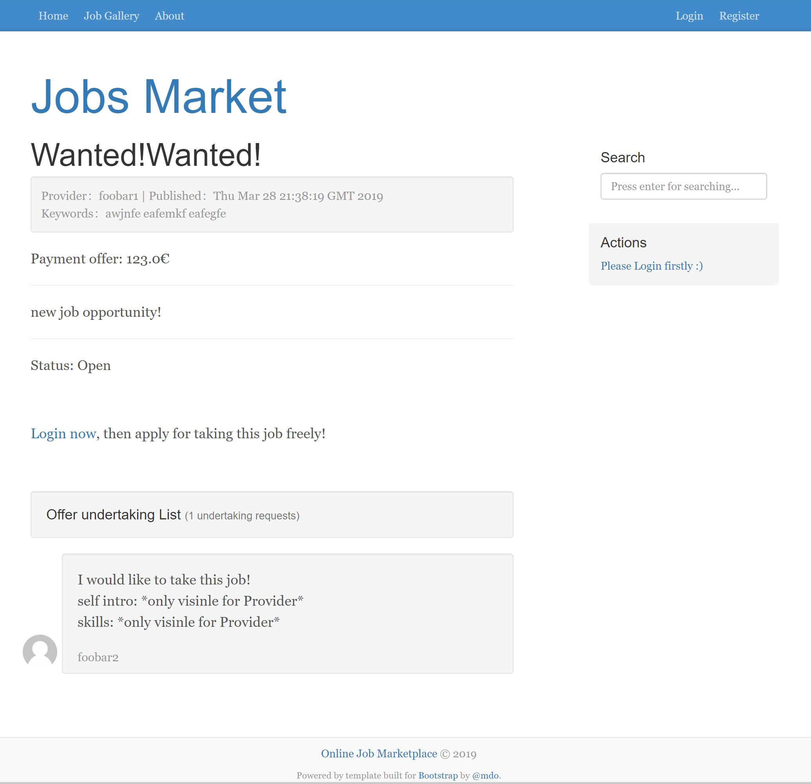
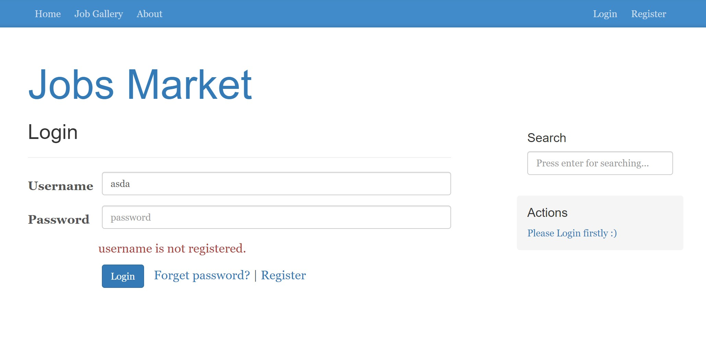
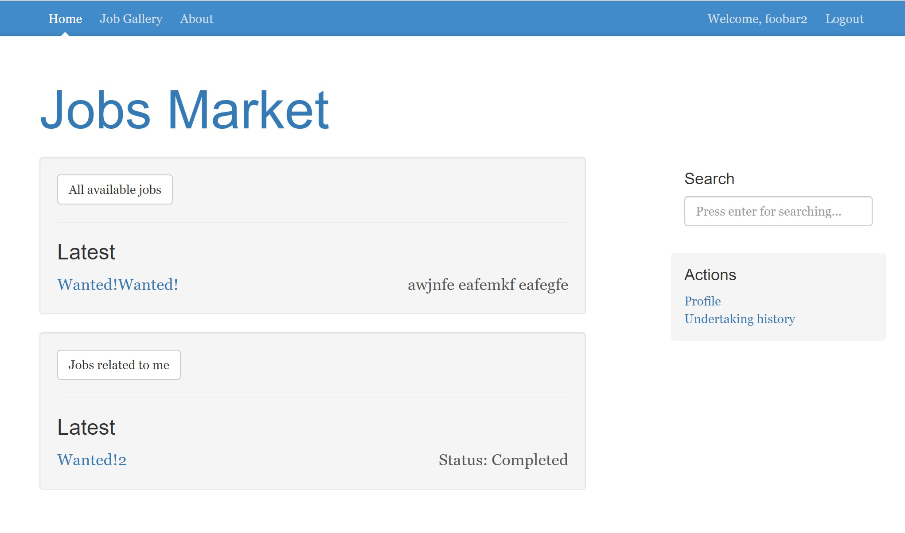
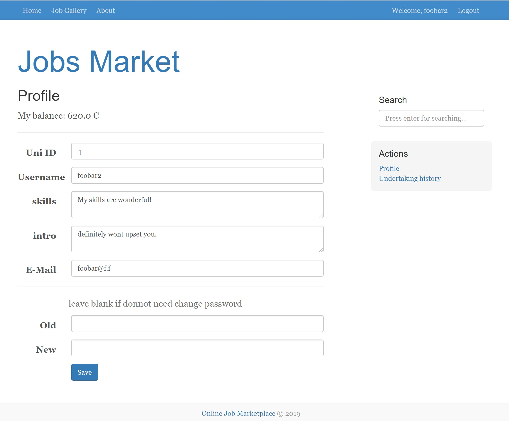
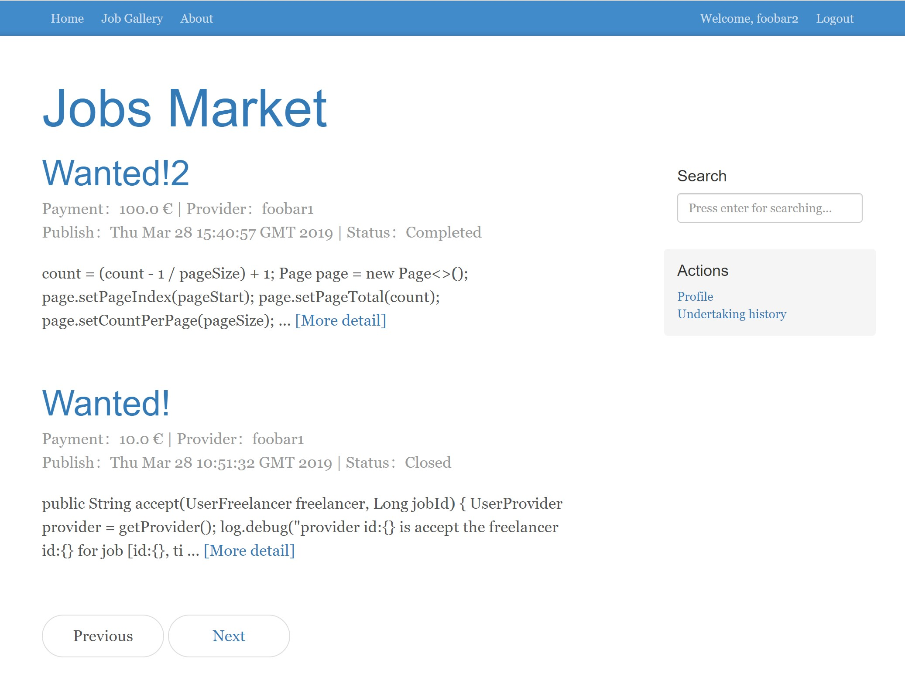
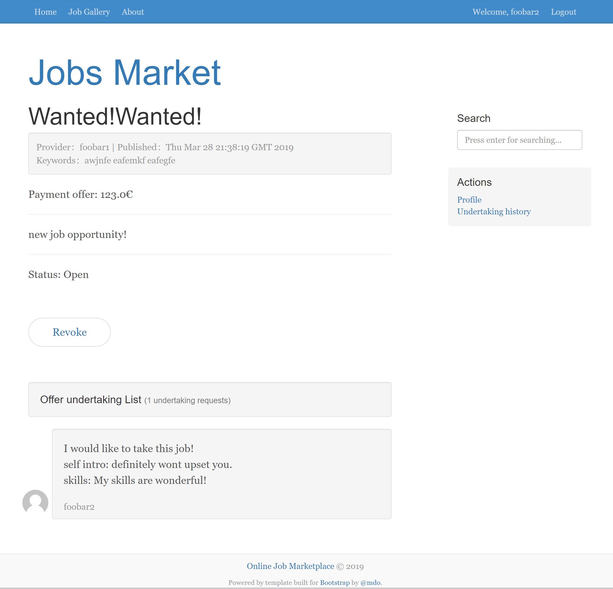
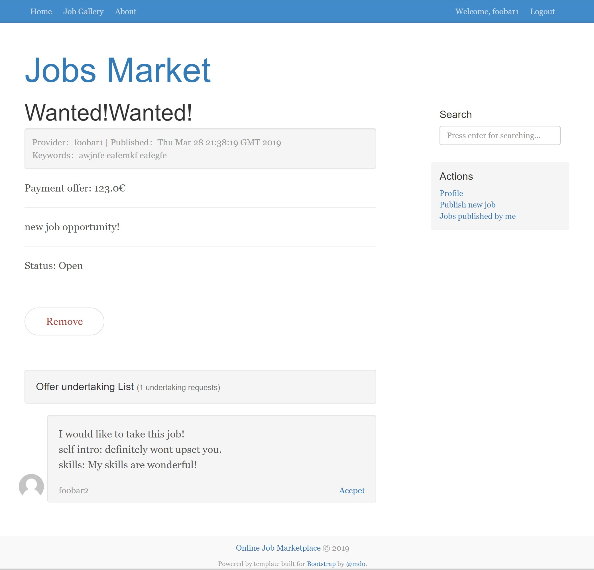
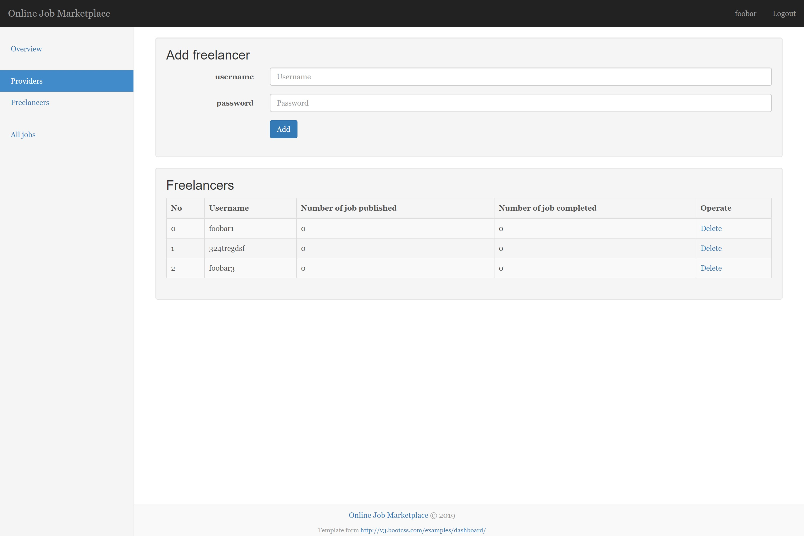
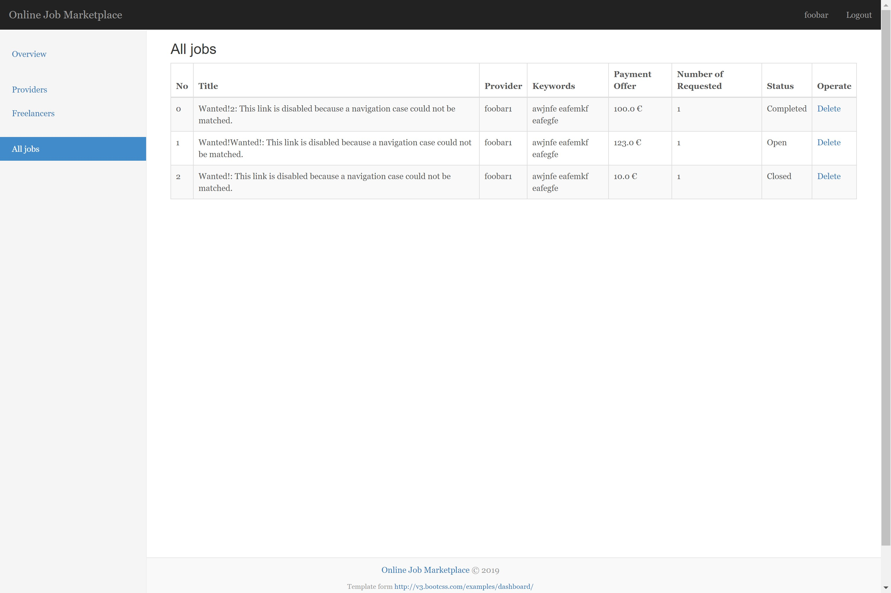

# job market
A course project built on the requirement from lecturer. Only for learning purpose.

> requirements document are located in ./doc

## roles
- freelancer
- job provider
- administrator

## techniques
EJB / JPA / MDB / JSF     

based on JDK8
(*for Glassfish5 container*)

## running instruction
- run glassfish server and mysql database
- import `./setup/glassfish-resources.xml` to setup glassfish.
- in case using IDEA as IDE, after importing maven project you can add running configuration now
    - Add `Glassfish Server/local`
    - in `deployment` tab, add artifact `war expoloded`/`jar expoloded`

> tip: you may need to add glassfish into `File | Settings | Build, Execution, Deployment | Application Servers` firstly.

## some pitfalls met are recorded on 

> Chinese only

<https://orangejuice.cc/code/ejb-project-establishing/>

## Demo

Guest

### freelancer

### provider

### administrator

